# Настройка облачной инфраструктуры для проекта по определению мошеннических транзакций


## 1 Создание бакета

1. Создадим бакет с точкой доступа `s3://anti-fraud-data-2` со следующими настройками:

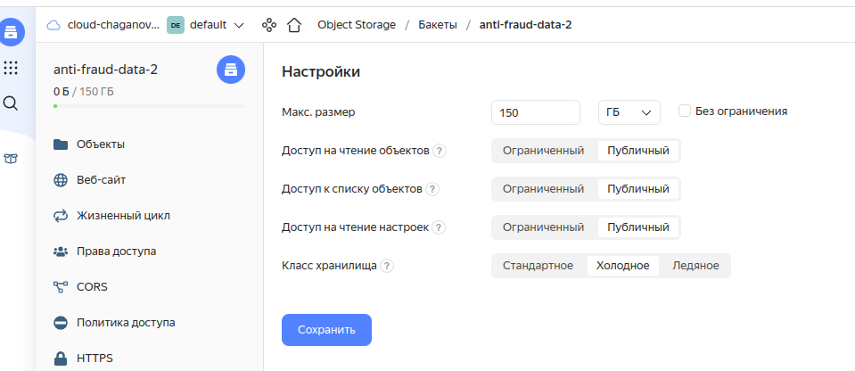

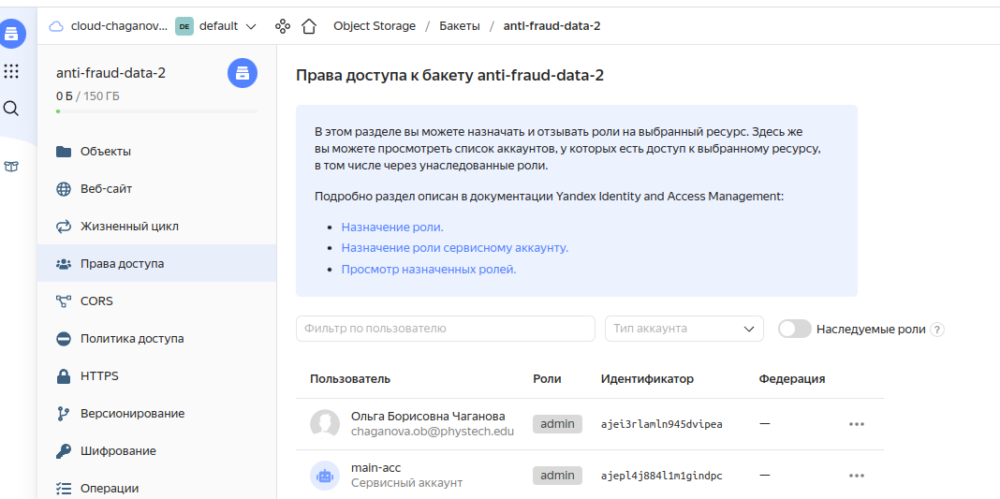


####  1 вариант
2. Для копирования файлов с `s3://mlops-data/fraud-data/` необходимо создать промежуточную вирутальную машину `anti-fraud-storage-data` (сделаем это через CLI):

```commandline
yc compute instance create --public-ip --preemptible --ssh-key=$HOME/.ssh/id_rsa.pub --memory 12GB --cores 4 --zone ru-central1-a --create-boot-disk size=150 anti-fraud-data-storage```
```

3. Установим на ней `s3cmd` и сконфигурируем его: `s3cmd --configure`. Далее скачаем все файлы из `s3://mlops-data/fraud-data/`:

```commandline
s3cmd get --recursive s3://mlops-data/fraud-data/ data/
```

4. Отправим все файлы на собственное S3-хранилище:

```commandline
s3cmd put * s3://anti-fraud-data
```

5. Удалим ВМ после использования: 

```commandline
yc compute instance delete anti-fraud-data-storage
```

#### 2 вариант

Более быстрый и прямой: через AWS CLI
```commandline
alias ycs3='aws s3 --endpoint-url=https://storage.yandexcloud.net'
ycs3 sync s3://mlops-data/fraud-data/ s3://anti-fraud-data-2
```

Результат:
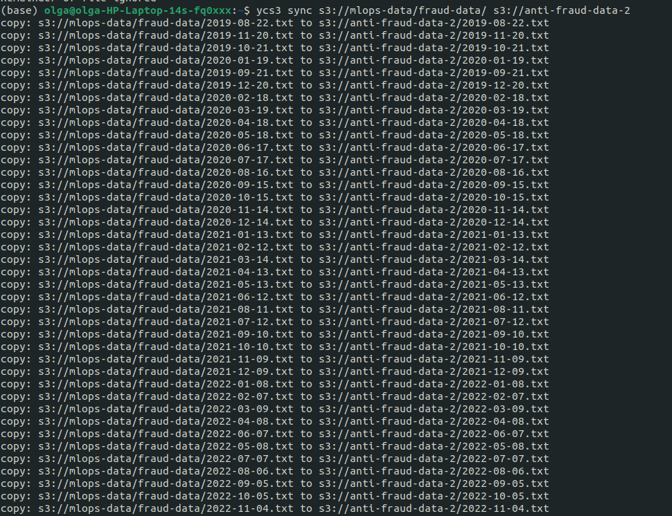


## 2 Создание DataProc сервиса

### 1 Создание бакета для журналов и результатов операций

Создадим бакет со следущими настройками:

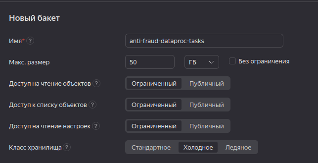

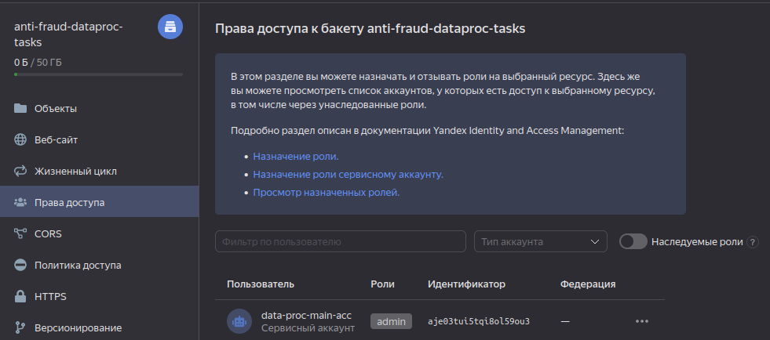


### 2 Создание DataProc через UI

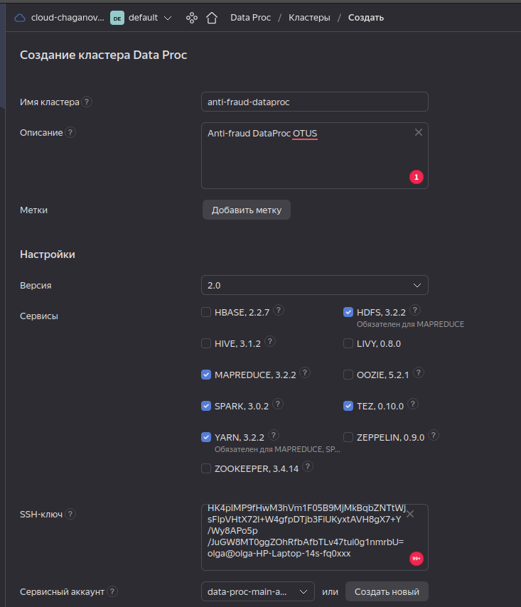

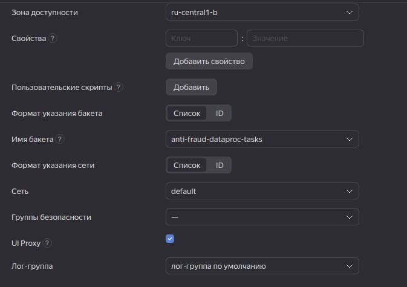

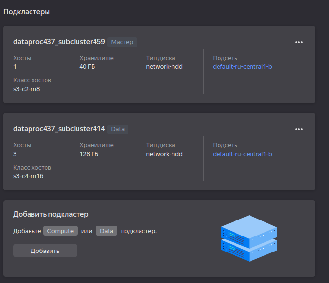

Для создания кластера необходимо также [настроить NAT-шлюз](https://cloud.yandex.ru/docs/vpc/operations/create-nat-gateway):

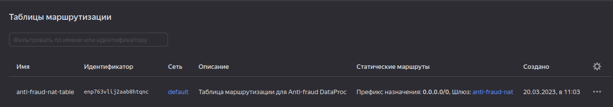

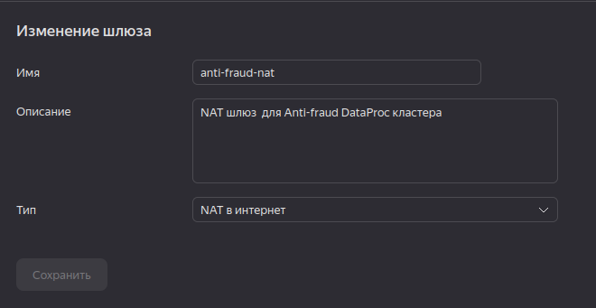

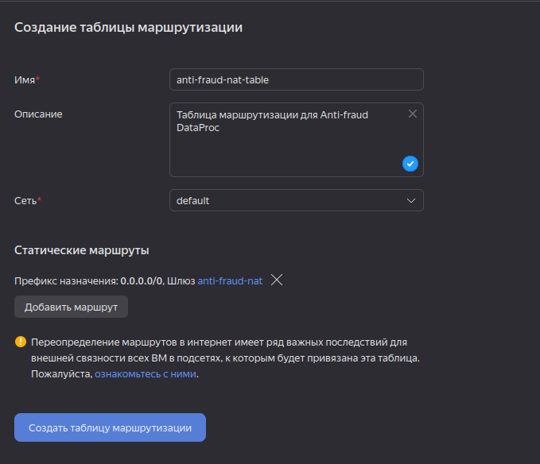

Таблицу маршрутизации необходимо привязать к требуемой подсети.


Кластер создан:

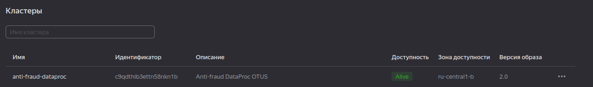

Поскольку кластер был создан без публичного доступа, к нему необходимо создать дополнительную ВМ (jump-сервер) в той же облачной сети. 
Тогда подключение с локальной машины будет осуществляться по SSH на jump-сервер, а с него можно будет подключиться к DataProc
кластеру по локальной сети.

Создадим jump-сервер в той же зоне доступности, что и DataProc-кластер:

```commandline
yc compute instance create --public-ip --preemptible --ssh-key=$HOME/.ssh/id_rsa.pub --memory 2GB --cores 2 --zone ru-central1-b --create-boot-disk size=3 anti-fraud-dataproc-jump
```

Соединиться с master-нодой можно следующей командой (в моем случае jump-сервер имеет публичный ip 51.250.19.200, а master-нода внутренний ip 10.129.0.8)

```commandline
ssh -J yc-user@51.250.19.200 ubuntu@10.129.0.8
```

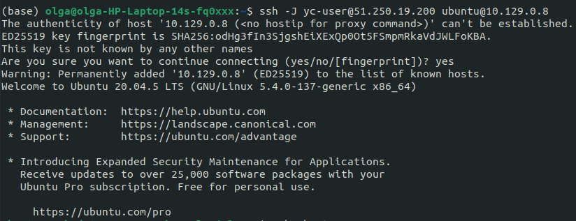

## 3 Копирование данных на HDFS

```commandline
hadoop fs -mkdir /user/data  # создадим папку в HDFS
hadoop distcp s3a://anti-fraud-data-2/* /user/data  # положим туда данные
```

Результат: 

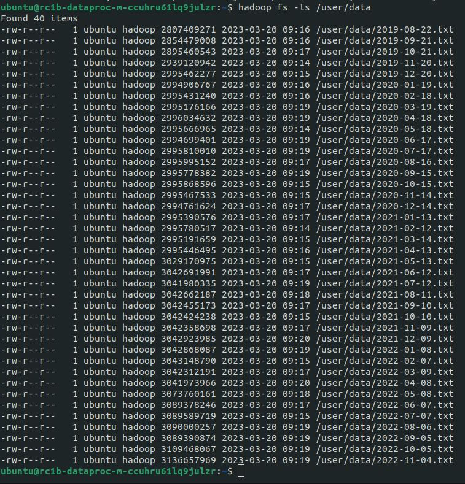


## 4 Оценка затрат

В месяц:
1) jump-сервер: 519 руб./мес. ([ссылка на расчет](https://cloud.yandex.ru/prices?state=788941d3f538#calculator))
2) DataProc-кластер: 23112 руб./мес. (скрин при создании кластера)

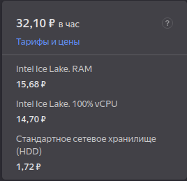

3) S3 хранилище: 872 руб./мес. ([ссылка на расчет](https://cloud.yandex.ru/prices?state=675cda6e1c70#calculator))

**Всего**: 23713 руб./мес.